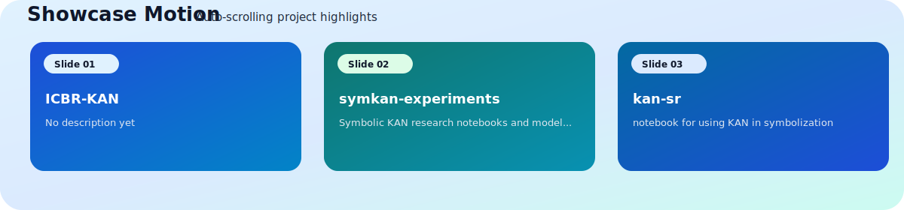

<div align="center">

<p>
  
</p>

<picture>
  <source media="(prefers-color-scheme: dark)" srcset="https://capsule-render.vercel.app/api?type=waving&height=220&text=Hi%2C%20I%27m%20ccstudentcc&fontAlignY=40&fontColor=ffffff&desc=Build%20in%20Public&descAlignY=60&descSize=18&descColor=e2e8f0&color=0:1d4ed8,50:2563eb,100:0ea5e9" />
  
</picture>

# ccstudentcc

### Student Developer | Building in Public

<p>
  <a href="#english">English</a> | <a href="#zh-cn">简体中文</a>
</p>

<p>
  <a href="#hero-studio">Hero</a> •
  <a href="#visitor-paths">Visitor Paths</a> •
  <a href="#kpi-grid">KPI Grid</a> •
  <a href="#showcase-carousel">Showcase</a> •
  <a href="#tech-stack">Tech Stack</a> •
  <a href="#github-analytics">Analytics</a> •
  <a href="#wakatime">WakaTime</a> •
  <a href="#automation-heartbeat">Automation</a>
</p>

<a href="https://github.com/ccstudentcc">
  <picture>
    <source media="(prefers-color-scheme: dark)" srcset="https://komarev.com/ghpvc/?username=ccstudentcc&label=Profile%20Views&color=3b82f6&style=for-the-badge" />
    
  </picture>
</a>
<a href="https://github.com/ccstudentcc?tab=followers">
  <picture>
    <source media="(prefers-color-scheme: dark)" srcset="https://img.shields.io/github/followers/ccstudentcc?label=Followers&style=for-the-badge&color=60a5fa" />
    
  </picture>
</a>
<a href="https://github.com/ccstudentcc?tab=repositories">
  <picture>
    <source media="(prefers-color-scheme: dark)" srcset="https://img.shields.io/badge/Open%20Source-Love-14b8a6?style=for-the-badge" />
    
  </picture>
</a>

<p>
  <sub>Building practical automation workflows for a cleaner developer profile and steady weekly progress.</sub>
</p>

</div>

<a id="hero-studio"></a>
## Hero Studio | 首屏主视觉

<div align="center">


<p>
  
</p>

<p>
  <sub><!--START_SECTION:hero_subtitle-->
Main narrative: shipping around [symkan-experiments](https://github.com/ccstudentcc/symkan-experiments) this week, with focus on active project exploration.
<!--END_SECTION:hero_subtitle--></sub>
</p>

</div>

### Product-Style Intro

- This profile is designed as a landing page, not a plain README.
- Strong visual center, then left-aligned information flow for readability.
- Every section is actionable: view metrics, explore projects, open feedback loops.

### 产品化说明

- 这个主页按“产品首页”方式设计，不是传统文档堆叠。
- 主视觉采用居中，信息块采用左对齐，兼顾冲击力与可读性。
- 每个模块都可点击、可展开、可跳转。

### Layout Constraints | 排版约束

- Badge groups use inline flow layout (continuous `picture`/`img` elements) to wrap automatically on narrow screens.
- 徽章组统一使用流式内联布局（连续 `picture`/`img`），在窄屏下自动换行。
- Avoid table-based layout for badge sections; keep mobile and desktop visually consistent.
- 徽章展示区避免表格结构，保证网页端与移动端一致性。

<p align="center">
  <a href="https://github.com/ccstudentcc?tab=repositories"></a>
  <a href="https://github.com/ccstudentcc/ccstudentcc/discussions/new/choose"></a>
  <a href="#automation-heartbeat"></a>
</p>

<a id="visitor-paths"></a>
## Visitor Paths | 访客入口卡

### Quick Routes

<div align="center">

<a href="#kpi-grid"></a>
<a href="https://github.com/ccstudentcc/ccstudentcc/discussions/new/choose"></a>
<a href="#automation-heartbeat"></a>

</div>

<p align="center">
  <sub>Recruiter: KPI signals -> Showcase proof -> Automation stability</sub><br/>
  <sub>Collaborator: Showcase projects -> Discussions -> Issues</sub><br/>
  <sub>Learner: Read metrics -> Follow workflow heartbeat</sub>
</p>

<a id="kpi-grid"></a>
## KPI Grid | 指标四宫格

<div align="center">


<p>
  <sub>Last Commit: Recent shipping cadence</sub><br/>
  <sub>Monthly Commits: Monthly production velocity</sub><br/>
  <sub>Open Issues: Feedback and iteration queue</sub><br/>
  <sub>Automation: Pipeline health in real time</sub>
</p>

<!--START_SECTION:realtime_panel-->
- Live sync: 2026-03-15 10:59 CST
- Data source: GitHub REST API + workflow-manager snapshot worker
- Showcase source: top 3 recently updated public repositories
- Current top repository: [symkan-experiments](https://github.com/ccstudentcc/symkan-experiments)
<!--END_SECTION:realtime_panel-->

</div>

<a id="showcase-carousel"></a>
## Showcase Carousel | 作品轮播风

<div align="center">



</div>

<p align="center">
  <sub>Top repositories auto-curated from recent activity, with concise context for fast scanning.</sub>
</p>

<!--START_SECTION:showcase_slides-->
<div align="center">

<a href="https://github.com/ccstudentcc/symkan-experiments"></a>
<a href="https://github.com/ccstudentcc/kan-sr"></a>
<a href="https://github.com/ccstudentcc/colab"></a>

</div>

<p align="center">
  <sub><b>symkan-experiments</b>: No description yet · <a href="https://github.com/ccstudentcc/symkan-experiments">Open repository</a></sub><br/>
  <sub><b>kan-sr</b>: No description yet · <a href="https://github.com/ccstudentcc/kan-sr">Open repository</a></sub><br/>
  <sub><b>colab</b>: auto save · <a href="https://github.com/ccstudentcc/colab">Open repository</a></sub>
</p>
<!--END_SECTION:showcase_slides-->

<details>
<summary><b>Interaction Map | 交互地图</b></summary>

- Recruiter path: [Hero](#hero-studio) -> [KPI Grid](#kpi-grid) -> [Showcase](#showcase-carousel)
- Collaborator path: [Showcase](#showcase-carousel) -> [Automation](#automation-heartbeat)
- Data path: [GitHub Analytics](#github-analytics) -> [WakaTime](#wakatime) -> [Automation Heartbeat](#automation-heartbeat)

</details>

### Now Building | 正在构建

- README automation engine with richer dashboard layers.
- Better profile storytelling with product-style information architecture.
- Data-driven weekly iteration loop (WakaTime + project snapshot + health signals).
- 持续迭代更有产品感的个人主页与自动化内容编排。

### Collaboration | 协作方式

- Use [Issues](https://github.com/ccstudentcc/ccstudentcc/issues/new) for bugs, ideas, and suggestions.
- Use [Discussions](https://github.com/ccstudentcc/ccstudentcc/discussions/new/choose) for longer technical conversations.
- Explore project details from [Repositories](https://github.com/ccstudentcc?tab=repositories).


---

<a id="tech-stack"></a>
## Tech Stack | 技术栈

All visual components below support both dark mode and light mode automatically.

<div align="center">

<picture>
  <source media="(prefers-color-scheme: dark)" srcset="https://img.shields.io/badge/Markdown-README%20Authoring-475569?style=for-the-badge&logo=markdown" />
  
</picture>
<picture>
  <source media="(prefers-color-scheme: dark)" srcset="https://img.shields.io/badge/YAML-Workflow%20Config-ef4444?style=for-the-badge&logo=yaml" />
  
</picture>
<picture>
  <source media="(prefers-color-scheme: dark)" srcset="https://img.shields.io/badge/GitHub%20Actions-Automation-60a5fa?style=for-the-badge&logo=githubactions&logoColor=white" />
  
</picture>
<picture>
  <source media="(prefers-color-scheme: dark)" srcset="https://img.shields.io/badge/Git-Version%20Control-f97316?style=for-the-badge&logo=git&logoColor=white" />
  
</picture>
<picture>
  <source media="(prefers-color-scheme: dark)" srcset="https://img.shields.io/badge/WakaTime-Coding%20Analytics-334155?style=for-the-badge&logo=wakatime" />
  
</picture>

</div>

<a id="github-analytics"></a>
## GitHub Analytics

<div align="center">

<picture>
  <source media="(prefers-color-scheme: dark)" srcset="https://github-readme-stats.vercel.app/api?username=ccstudentcc&show_icons=true&rank_icon=github&hide_border=true&theme=tokyonight" />
  
</picture>
<picture>
  <source media="(prefers-color-scheme: dark)" srcset="https://streak-stats.demolab.com?user=ccstudentcc&hide_border=true&theme=tokyonight" />
  
</picture>

</div>

<div align="center">

<picture>
  <source media="(prefers-color-scheme: dark)" srcset="https://github-readme-stats.vercel.app/api/top-langs/?username=ccstudentcc&layout=compact&hide_border=true&theme=tokyonight" />
  
</picture>

</div>

<a id="wakatime"></a>
## WakaTime This Week | 本周编码时长

<!--START_SECTION:waka-->
<div align="center">

<picture>
  <source media="(prefers-color-scheme: dark)" srcset="https://img.shields.io/static/v1?label=Code%20Time&message=2%20hrs%2018%20mins&color=334155&style=for-the-badge&logo=wakatime" />
  
</picture>
<picture>
  <source media="(prefers-color-scheme: dark)" srcset="https://img.shields.io/static/v1?label=Daily%20Average&message=19%20mins&color=475569&style=for-the-badge" />
  
</picture>
<picture>
  <source media="(prefers-color-scheme: dark)" srcset="https://img.shields.io/static/v1?label=Last%20Sync&message=2026-03-15%2010%3A59%20CST&color=1e293b&style=for-the-badge" />
  
</picture>
<picture>
  <source media="(prefers-color-scheme: dark)" srcset="https://img.shields.io/static/v1?label=Top%20Language&message=Markdown&color=0f766e&style=for-the-badge" />
  
</picture>
<picture>
  <source media="(prefers-color-scheme: dark)" srcset="https://img.shields.io/static/v1?label=Top%20Project&message=ccstudentcc&color=4c1d95&style=for-the-badge" />
  
</picture>

<sub>Focus: Markdown (1 hr 28 mins, 63.6%) | Project: ccstudentcc (2 hrs 8 mins, 92.8%) | Editor: VS Code</sub>

</div>

<details>
<summary><b>Weekly Breakdown | 本周明细</b></summary>

```text
Timezone: Asia/Shanghai (UTC+8)
Updated At (CST): 2026-03-15 10:59 CST

Languages:
  Markdown    1 hr 28 mins  [#################---------]  63.6%
  YAML        23 mins       [####----------------------]  16.8%
  JSON        19 mins       [####----------------------]  14.1%
  Git Config  4 mins        [#-------------------------]   3.0%
  Python      2 mins        [--------------------------]   1.7%

Editors:
  VS Code  2 hrs 18 mins  [##########################] 100.0%

Projects:
  ccstudentcc         2 hrs 8 mins  [########################--]  92.8%
  symkan-experiments  9 mins        [##------------------------]   7.2%

Operating Systems:
  Linux    1 hr 10 mins  [#############-------------]  50.9%
  Windows  1 hr 7 mins   [#############-------------]  49.1%

Generated by workflow-manager
```

</details>
<!--END_SECTION:waka-->

---

<a id="english"></a>
## English

<details open>
<summary><b>Open English Section</b></summary>

### About Me

- This repository is my profile hub for stats, coding activity, and progress tracking.
- I build in public and improve engineering habits with weekly iteration.
- Goal: small but consistent improvements every week.

### Profile Infrastructure

- README profile page: Showcase identity and development progress (Active)
- Workflow manager: Orchestrate all README automation workflows (Active)
- GitHub stats cards: Visualize contribution and language trends (Active)
- WakaTime workflow: Auto-sync weekly coding activity (Active)
- Featured projects workflow: Kept for compatibility in automation pipeline (Active)
- Snapshot workflow: Auto-refresh showcase slides and heartbeat (Active)

### 2026 Roadmap
- [x] Build a complete profile README
- [x] Add automatic WakaTime updates
- [x] Build showcase carousel and slide cards
- [x] Simplify project display to showcase-first layout
- [ ] Add learning log section (monthly updates)
- [x] Add contact links (email / social)

### Current Focus

- Keeping coding time consistent and visible through WakaTime
- Building and polishing portfolio-ready repositories
- Practicing system thinking: code quality, structure, and automation

### What I Am Building Now

- A profile README that behaves like a mini product landing page
- Automation-first workflow orchestration for repeatable weekly updates
- Reusable templates for project documentation and metrics storytelling

### Collaboration Notes

- Best channel for feature ideas: GitHub Discussions
- Best channel for concrete tasks or bugs: GitHub Issues
- Typical response cadence: within a few days when active

### Connect

<a href="https://github.com/ccstudentcc">
  <picture>
    <source media="(prefers-color-scheme: dark)" srcset="https://img.shields.io/badge/GitHub-ccstudentcc-374151?style=for-the-badge&logo=github" />
    
  </picture>
</a>

</details>

<a id="zh-cn"></a>
## 简体中文

<details>
<summary><b>展开简体中文内容</b></summary>

### 关于我

- 这个仓库是我的个人主页中心，用于展示统计、编码活动和成长进度。
- 我通过公开构建和每周迭代，持续提升工程实践能力。
- 目标：每周都有小而稳定的进步。

### 主页基础设施

- README 主页：展示个人定位与成长进度（运行中）
- 工作流管理器：统一编排 README 自动化工作流（运行中）
- GitHub 数据卡片：可视化贡献与语言趋势（运行中）
- WakaTime 工作流：自动同步每周编码活动（运行中）
- 精选项目工作流：为自动化兼容保留（运行中）
- 快照工作流：自动刷新 Showcase 卡片与心跳状态（运行中）

### 2026 路线图

- [x] 完成个人主页 README
- [x] 接入 WakaTime 自动更新
- [x] 完成 Showcase 轮播与卡片展示
- [x] 项目展示改为 Showcase 主入口
- [ ] 增加学习日志版块（按月更新）
- [x] 增加联系方式（邮箱 / 社交）

### 当前重点

- 通过 WakaTime 保持稳定可见的编码节奏
- 打磨可用于作品集展示的仓库
- 训练系统化思维：代码质量、结构设计与自动化

### 当前在做

- 把个人 README 打造成更像产品落地页的展示系统
- 用自动化编排保证每周更新稳定、可复用、可追踪
- 沉淀可迁移的项目文档模板与指标叙事结构

### 协作说明

- 功能想法与讨论优先使用 GitHub Discussions
- 具体问题、缺陷与可执行任务优先使用 GitHub Issues
- 活跃阶段一般在数天内回复

### 联系方式

<a href="https://github.com/ccstudentcc">
  <picture>
    <source media="(prefers-color-scheme: dark)" srcset="https://img.shields.io/badge/GitHub-ccstudentcc-374151?style=for-the-badge&logo=github" />
    
  </picture>
</a>
<a href="https://github.com/ccstudentcc/ccstudentcc/discussions/new/choose">
  <picture>
    <source media="(prefers-color-scheme: dark)" srcset="https://img.shields.io/badge/Discussions-Open%20Topic-0f766e?style=for-the-badge&logo=github" />
    
  </picture>
</a>
<a href="https://github.com/ccstudentcc/ccstudentcc/issues/new">
  <picture>
    <source media="(prefers-color-scheme: dark)" srcset="https://img.shields.io/badge/Issues-Create%20Ticket-0284c7?style=for-the-badge&logo=github" />
    
  </picture>
</a>

</details>

<a id="automation-heartbeat"></a>
<details>
<summary><b>Automation Heartbeat | 自动化心跳</b></summary>

### Orchestrator Status

<!--START_SECTION:automation_status-->
- Last automation update: 2026-03-15 10:59 CST
- Timezone: Asia/Shanghai (UTC+8)
- Orchestrator: profile-readme-automation (DAG nodes 4, edges 2)
- Scheduler trigger: workflow_dispatch | cron 0 4,16 * * * | policy higher-first
- Worker pool model: logical worker pools inside a single GitHub Actions run
- Managed jobs: featured-projects, wakatime, daily-quote, snapshot
- Failure policy: continue-on-error + retry + timeout cancel + dead-letter on exhaust
- Run URL: https://github.com/ccstudentcc/ccstudentcc/actions/runs/23102035351
<!--END_SECTION:automation_status-->

### Workflow DAG

<!--START_SECTION:workflow_dag-->
- featured-projects: depends on root | condition always | pool content-pool | priority 90
- wakatime: depends on root | condition env_exists(WAKATIME_API_KEY) | pool metrics-pool | priority 100
- daily-quote: depends on root | condition always | pool engagement-pool | priority 30
- snapshot: depends on featured-projects, daily-quote | condition all_success | pool content-pool | priority 60
<!--END_SECTION:workflow_dag-->

### Scheduler State

<!--START_SECTION:scheduler_state-->
- Trigger: workflow_dispatch
- Cron: 0 4,16 * * *
- Ready queue: empty
- Deferred tasks: 0
- Running tasks: 0
- Completed tasks: 4
- Delay strategy: defer-until-ready | parallel execution: True
<!--END_SECTION:scheduler_state-->

### Logical Worker Pools

<!--START_SECTION:worker_pools-->
- content-pool: logical type content-sync | desired 1 | active 0 | max 2 | queued 0 | completed 2 | queue 0, active 0, target 1 per worker
- metrics-pool: logical type metrics-sync | desired 1 | active 0 | max 1 | queued 0 | completed 1 | queue 0, active 0, target 1 per worker
- engagement-pool: logical type engagement-sync | desired 1 | active 0 | max 1 | queued 0 | completed 1 | queue 0, active 0, target 2 per worker
<!--END_SECTION:worker_pools-->

### Worker Registry

<!--START_SECTION:worker_registry-->
- featured-projects: Featured Projects | enabled | type content-sync | pool content-pool | capabilities readme-write, repo-discovery
- wakatime: WakaTime | enabled | type metrics-sync | pool metrics-pool | capabilities readme-write, external-api
- daily-quote: Daily Quote | enabled | type engagement-sync | pool engagement-pool | capabilities readme-write, content-generation
- snapshot: Snapshot | enabled | type content-sync | pool content-pool | capabilities readme-write, repo-discovery
<!--END_SECTION:worker_registry-->

### Worker Health Check

<!--START_SECTION:worker_health-->
- featured-projects: Healthy | heartbeat 2026-03-15 10:59 CST | last success 2026-03-15 10:59 CST
- wakatime: Healthy | heartbeat 2026-03-15 10:59 CST | last success 2026-03-15 10:59 CST
- daily-quote: Healthy | heartbeat 2026-03-15 10:59 CST | last success 2026-03-15 10:59 CST
- snapshot: Healthy | heartbeat 2026-03-15 10:59 CST | last success 2026-03-15 10:59 CST
<!--END_SECTION:worker_health-->

### Task State

<!--START_SECTION:task_state-->
- featured-projects: Success | priority 90 | attempt 1/2 | pool content-pool | updated 2026-03-15 10:59 CST | Updated featured projects: symkan-experiments kan-sr colab
- wakatime: Success | priority 100 | attempt 1/2 | pool metrics-pool | updated 2026-03-15 10:59 CST | Updated WakaTime section
- daily-quote: Success | priority 30 | attempt 1/2 | pool engagement-pool | updated 2026-03-15 10:59 CST | Updated daily quote: Mahatma Gandhi
- snapshot: Success | priority 60 | attempt 1/2 | pool content-pool | updated 2026-03-15 10:59 CST | Updated recent repository snapshot with 5 entries and refreshed showcase assets
<!--END_SECTION:task_state-->

### Dead Letter Queue

<!--START_SECTION:dead_letters-->
- No dead letters.
<!--END_SECTION:dead_letters-->

</details>

---

<div align="center">

<!--START_SECTION:daily_quote-->
> The future depends on what you do today.
>
> — Mahatma Gandhi
<!--END_SECTION:daily_quote-->

</div>
