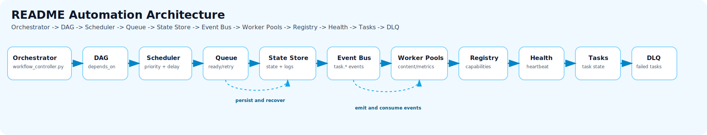

<div align="center">

<p>
  
</p>

<picture>
  <source media="(prefers-color-scheme: dark)" srcset="https://capsule-render.vercel.app/api?type=waving&height=220&text=Hi%2C%20I%27m%20ccstudentcc&fontAlignY=40&fontColor=ffffff&desc=Build%20in%20Public&descAlignY=60&descSize=18&descColor=e2e8f0&color=0:1d4ed8,50:2563eb,100:0ea5e9" />
  
</picture>

# ccstudentcc

### Student Developer | Building in Public

<p>
  <a href="#english">English</a> | <a href="#zh-cn">简体中文</a>
</p>

<p>
  <a href="#hero-studio">Hero</a> •
  <a href="#visitor-paths">Visitor Paths</a> •
  <a href="#kpi-grid">KPI Grid</a> •
  <a href="#showcase-carousel">Showcase</a> •
  <a href="#tech-stack">Tech Stack</a> •
  <a href="#github-analytics">Analytics</a> •
  <a href="#wakatime">WakaTime</a> •
  <a href="#automation-heartbeat">Automation</a>
</p>

<a href="https://github.com/ccstudentcc">
  <picture>
    <source media="(prefers-color-scheme: dark)" srcset="https://komarev.com/ghpvc/?username=ccstudentcc&label=Profile%20Views&color=3b82f6&style=for-the-badge" />
    
  </picture>
</a>
<a href="https://github.com/ccstudentcc?tab=followers">
  <picture>
    <source media="(prefers-color-scheme: dark)" srcset="https://img.shields.io/github/followers/ccstudentcc?label=Followers&style=for-the-badge&color=60a5fa" />
    
  </picture>
</a>
<a href="https://github.com/ccstudentcc?tab=repositories">
  <picture>
    <source media="(prefers-color-scheme: dark)" srcset="https://img.shields.io/static/v1?label=Open%20Source&message=Love&color=14b8a6&style=for-the-badge" />
    
  </picture>
</a>

<p>
  <sub>Building practical automation workflows for a cleaner developer profile and steady weekly progress.</sub>
</p>

</div>

<a id="hero-studio"></a>
## Hero Studio | 首屏主视觉

<div align="center">



<p>
  
</p>

<p>
  <sub><!--START_SECTION:hero_subtitle-->
Main narrative: shipping around <a href="https://github.com/ccstudentcc/symkan-experiments">symkan-experiments</a> this week, with focus on Symbolic KAN research notebooks and model experiments.
<!--END_SECTION:hero_subtitle--></sub>
</p>

</div>

### Product-Style Intro

- This profile is designed as a landing page, not a plain README.
- Strong visual center, then left-aligned information flow for readability.
- Every section is actionable: view metrics, explore projects, open feedback loops.

### 产品化说明

- 这个主页按“产品首页”方式设计，不是传统文档堆叠。
- 主视觉采用居中，信息块采用左对齐，兼顾冲击力与可读性。
- 每个模块都可点击、可展开、可跳转。

### Layout Constraints | 排版约束

- Badge groups use inline flow layout (continuous `picture`/`img` elements) to wrap automatically on narrow screens.
- 徽章组统一使用流式内联布局（连续 `picture`/`img`），在窄屏下自动换行。
- Avoid table-based layout for badge sections; keep mobile and desktop visually consistent.
- 徽章展示区避免表格结构，保证网页端与移动端一致性。

<a id="visitor-paths"></a>
## Visitor Paths | 访客入口卡

### Quick Routes

<div align="center">

<a href="#kpi-grid"></a>
<a href="https://github.com/ccstudentcc/ccstudentcc/discussions/new/choose"></a>
<a href="#automation-heartbeat"></a>

</div>

<p align="center">
  <sub>Recruiter: KPI signals -> Showcase proof -> Automation stability</sub><br/>
  <sub>Collaborator: Showcase projects -> Discussions -> Issues</sub><br/>
  <sub>Learner: Read metrics -> Follow workflow heartbeat</sub>
</p>

<a id="kpi-grid"></a>
## KPI Grid | 指标四宫格

<div align="center">


<p>
  <sub>Last Commit: Recent shipping cadence</sub><br/>
  <sub>Monthly Commits: Monthly production velocity</sub><br/>
  <sub>Open Issues: Feedback and iteration queue</sub><br/>
  <sub>Automation: Pipeline health in real time</sub>
</p>

<!--START_SECTION:realtime_panel-->
<sub>- Live sync: 2026-03-16 21:43 CST</sub>
<sub>- Data source: GitHub REST API + workflow-manager snapshot worker</sub>
<sub>- Showcase source: top 3 recently updated public repositories</sub>
<sub>- Current top repository: <a href="https://github.com/ccstudentcc/symkan-experiments">symkan-experiments</a></sub>
<!--END_SECTION:realtime_panel-->

</div>

<a id="showcase-carousel"></a>
## Showcase Carousel | 作品轮播风

<div align="center">

<!--START_SECTION:showcase_image-->

<!--END_SECTION:showcase_image-->

</div>

<p align="center">
  <sub>Top repositories auto-curated from recent activity, with concise context for fast scanning.</sub>
</p>

<!--START_SECTION:showcase_slides-->
<div align="center">

<a href="https://github.com/ccstudentcc/symkan-experiments"></a>
<a href="https://github.com/ccstudentcc/oop"></a>
<a href="https://github.com/ccstudentcc/kan-sr"></a>

</div>

<p align="center">
  <sub><b>symkan-experiments</b>: Symbolic KAN research notebooks and model e... · <a href="https://github.com/ccstudentcc/symkan-experiments">Open repository</a></sub><br/>
  <sub><b>oop</b>: No description yet · <a href="https://github.com/ccstudentcc/oop">Open repository</a></sub><br/>
  <sub><b>kan-sr</b>: notebook for using KAN in symbolization · <a href="https://github.com/ccstudentcc/kan-sr">Open repository</a></sub>
</p>
<!--END_SECTION:showcase_slides-->

<details>
<summary><b>Interaction Map | 交互地图</b></summary>

- Recruiter path: <a href="#hero-studio">Hero</a> -> <a href="#kpi-grid">KPI Grid</a> -> <a href="#showcase-carousel">Showcase</a>
- Collaborator path: <a href="#showcase-carousel">Showcase</a> -> <a href="#automation-heartbeat">Automation</a>
- Data path: <a href="#github-analytics">GitHub Analytics</a> -> <a href="#wakatime">WakaTime</a> -> <a href="#automation-heartbeat">Automation Heartbeat</a>

</details>

### Now Building | 正在构建

- README automation engine with richer dashboard layers.
- Better profile storytelling with product-style information architecture.
- Data-driven weekly iteration loop (WakaTime + project snapshot + health signals).
- 持续迭代更有产品感的个人主页与自动化内容编排。

### Collaboration | 协作方式

- Use [Issues](https://github.com/ccstudentcc/ccstudentcc/issues/new) for bugs, ideas, and suggestions.
- Use [Discussions](https://github.com/ccstudentcc/ccstudentcc/discussions/new/choose) for longer technical conversations.
- Explore project details from [Repositories](https://github.com/ccstudentcc?tab=repositories).


---

<a id="tech-stack"></a>
## Tech Stack | 技术栈

All visual components below support both dark mode and light mode automatically.

<div align="center">

<picture>
  <source media="(prefers-color-scheme: dark)" srcset="https://img.shields.io/static/v1?label=Markdown&message=README%20Authoring&color=475569&style=for-the-badge&logo=markdown" />
  
</picture>
<picture>
  <source media="(prefers-color-scheme: dark)" srcset="https://img.shields.io/static/v1?label=YAML&message=Workflow%20Config&color=ef4444&style=for-the-badge&logo=yaml" />
  
</picture>
<picture>
  <source media="(prefers-color-scheme: dark)" srcset="https://img.shields.io/static/v1?label=GitHub%20Actions&message=Automation&color=60a5fa&style=for-the-badge&logo=githubactions&logoColor=white" />
  
</picture>
<picture>
  <source media="(prefers-color-scheme: dark)" srcset="https://img.shields.io/static/v1?label=Git&message=Version%20Control&color=f97316&style=for-the-badge&logo=git&logoColor=white" />
  
</picture>
<picture>
  <source media="(prefers-color-scheme: dark)" srcset="https://img.shields.io/static/v1?label=WakaTime&message=Coding%20Analytics&color=334155&style=for-the-badge&logo=wakatime" />
  
</picture>

</div>

<a id="github-analytics"></a>
## GitHub Analytics

<div align="center">

<picture>
  <source media="(prefers-color-scheme: dark)" srcset="https://github-readme-stats.vercel.app/api?username=ccstudentcc&show_icons=true&rank_icon=github&hide_border=true&theme=tokyonight" />
  
</picture>
<picture>
  <source media="(prefers-color-scheme: dark)" srcset="https://streak-stats.demolab.com?user=ccstudentcc&hide_border=true&theme=tokyonight" />
  
</picture>

</div>

<div align="center">

<picture>
  <source media="(prefers-color-scheme: dark)" srcset="https://github-readme-stats.vercel.app/api/top-langs/?username=ccstudentcc&layout=compact&hide_border=true&theme=tokyonight" />
  
</picture>

</div>

<a id="wakatime"></a>
## WakaTime This Week | 本周编码时长

<!--START_SECTION:waka-->
<div align="center">

<picture>
  <source media="(prefers-color-scheme: dark)" srcset="https://img.shields.io/static/v1?label=Code%20Time&message=7%20hrs%201%20min&color=334155&style=for-the-badge&logo=wakatime" />
  
</picture>
<picture>
  <source media="(prefers-color-scheme: dark)" srcset="https://img.shields.io/static/v1?label=Daily%20Average&message=7%20hrs%203%20mins&color=475569&style=for-the-badge" />
  
</picture>
<picture>
  <source media="(prefers-color-scheme: dark)" srcset="https://img.shields.io/static/v1?label=Last%20Sync&message=2026-03-16%2021%3A43%20CST&color=1e293b&style=for-the-badge" />
  
</picture>
<picture>
  <source media="(prefers-color-scheme: dark)" srcset="https://img.shields.io/static/v1?label=Top%20Language&message=Markdown&color=0f766e&style=for-the-badge" />
  
</picture>
<picture>
  <source media="(prefers-color-scheme: dark)" srcset="https://img.shields.io/static/v1?label=Top%20Project&message=ccstudentcc&color=4c1d95&style=for-the-badge" />
  
</picture>
<picture>
  <source media="(prefers-color-scheme: dark)" srcset="https://img.shields.io/static/v1?label=All%20Time&message=15%20hrs%2027%20mins&color=475569&style=for-the-badge&logo=wakatime" />
  
</picture>

<sub>Focus: Markdown (3 hrs 4 mins, 43.5%) | Project: ccstudentcc (6 hrs 56 mins, 98.3%) | Editor: VS Code</sub>
<sub>Code Time badge scope: Today (fallback: Last 7 Days)</sub>

</div>

<details>
<sub>state.json, metadata-store.json, queue.json, dag.json, scheduler.json, event-log.json, dead-letters.json</sub>
</details>

<details>
<summary><b>守护进程持久化建议</b></summary>

<sub>长期运行的 controller/daemon 在运行期间应定期将内存中待写入队列落盘，并在主循环结束或进程退出前强制一次最终落盘，推荐做法：</sub>

- **周期性 flush**：在主循环或调度点周期性调用 `flush_json_writes(force=True)`，以确保批量写入不会长时间停留在内存中。
- **退出时强制 flush**：在退出流程中（`atexit` 回调或 `SIGINT`/`SIGTERM` 处理器）调用 `flush_json_writes(force=True)`，确保最后的队列被写入磁盘。
- **配置注意**：当环境变量 `WORKFLOW_WRITE_BATCHING` 为 `true` 时写入会被去抖（debounce），可通过 `WORKFLOW_WRITE_DEBOUNCE_SECONDS` 调整去抖窗口；在需要即时持久化的路径上使用 `force=True`。

示例（伪代码）：

```python
from .workflow_common import flush_json_writes
import atexit, signal

def on_exit(*_):
  flush_json_writes(force=True)

atexit.register(on_exit)
signal.signal(signal.SIGINT, on_exit)
signal.signal(signal.SIGTERM, on_exit)

# 主循环中在合适频率也可以调用
flush_json_writes(force=True)
```

</details>

```text
Timezone: Asia/Shanghai (UTC+8)
Updated At (CST): 2026-03-16 21:43 CST
Window: This Week | Total: 7 hrs 3 mins

Languages:
  Markdown    3 hrs 4 mins  [###########---------------]  43.5%
  Python      1 hr 30 mins  [######--------------------]  21.3%
  YAML        1 hr 14 mins  [#####---------------------]  17.5%
  JSON        44 mins       [###-----------------------]  10.5%
  Git Config  25 mins       [##------------------------]   6.1%

Editors:
  VS Code  7 hrs 3 mins  [##########################] 100.0%

Projects:
  ccstudentcc      6 hrs 56 mins  [##########################]  98.3%
  Unknown Project  7 mins        [--------------------------]   1.7%

Operating Systems:
  Windows  7 hrs 3 mins  [##########################] 100.0%

Machines:
  Peng  7 hrs 3 mins  [##########################] 100.0%

Generated by workflow-manager
```

</details>
<!--END_SECTION:waka-->

---

<a id="english"></a>
## English

<details open>
<summary><b>Open English Section</b></summary>

### About Me

- This repository is my profile hub for stats, coding activity, and progress tracking.
- I build in public and improve engineering habits with weekly iteration.
- Goal: small but consistent improvements every week.

### Profile Infrastructure

- README profile page: Showcase identity and development progress (Active)
- Workflow manager: Orchestrate all README automation workflows (Active)
- GitHub stats cards: Visualize contribution and language trends (Active)
- WakaTime workflow: Auto-sync weekly coding activity (Active)
- Featured projects workflow: Retained as a standalone compatibility path for manual runs (Active)
- Snapshot workflow: Auto-refresh showcase slides and heartbeat (Active)

### 2026 Roadmap
- [x] Build a complete profile README
- [x] Add automatic WakaTime updates
- [x] Build showcase carousel and slide cards
- [x] Simplify project display to showcase-first layout
- [ ] Add learning log section (monthly updates)
- [x] Add contact links (email / social)

### Current Focus

- Keeping coding time consistent and visible through WakaTime
- Building and polishing portfolio-ready repositories
- Practicing system thinking: code quality, structure, and automation

### What I Am Building Now

- A profile README that behaves like a mini product landing page
- Automation-first workflow orchestration for repeatable weekly updates
- Reusable templates for project documentation and metrics storytelling

### Collaboration Notes

- Best channel for feature ideas: GitHub Discussions
- Best channel for concrete tasks or bugs: GitHub Issues
- Typical response cadence: within a few days when active

### Connect

<a href="https://github.com/ccstudentcc">
  <picture>
    <source media="(prefers-color-scheme: dark)" srcset="https://img.shields.io/static/v1?label=GitHub&message=ccstudentcc&color=374151&style=for-the-badge&logo=github" />
    
  </picture>
</a>

</details>

<a id="zh-cn"></a>
## 简体中文

<details>
<summary><b>展开简体中文内容</b></summary>

### 关于我

- 这个仓库是我的个人主页中心，用于展示统计、编码活动和成长进度。
- 我通过公开构建和每周迭代，持续提升工程实践能力。
- 目标：每周都有小而稳定的进步。

### 主页基础设施

- README 主页：展示个人定位与成长进度（运行中）
- 工作流管理器：统一编排 README 自动化工作流（运行中）
- GitHub 数据卡片：可视化贡献与语言趋势（运行中）
- WakaTime 工作流：自动同步每周编码活动（运行中）
- 精选项目工作流：作为手动运行的兼容刷新路径保留（运行中）
- 快照工作流：自动刷新 Showcase 卡片与心跳状态（运行中）

### 2026 路线图

- [x] 完成个人主页 README
- [x] 接入 WakaTime 自动更新
- [x] 完成 Showcase 轮播与卡片展示
- [x] 项目展示改为 Showcase 主入口
- [ ] 增加学习日志版块（按月更新）
- [x] 增加联系方式（邮箱 / 社交）

### 当前重点

- 通过 WakaTime 保持稳定可见的编码节奏
- 打磨可用于作品集展示的仓库
- 训练系统化思维：代码质量、结构设计与自动化

### 当前在做

- 把个人 README 打造成更像产品落地页的展示系统
- 用自动化编排保证每周更新稳定、可复用、可追踪
- 沉淀可迁移的项目文档模板与指标叙事结构

### 协作说明

- 功能想法与讨论优先使用 GitHub Discussions
- 具体问题、缺陷与可执行任务优先使用 GitHub Issues
- 活跃阶段一般在数天内回复

### 联系方式

<a href="https://github.com/ccstudentcc">
  <picture>
    <source media="(prefers-color-scheme: dark)" srcset="https://img.shields.io/static/v1?label=GitHub&message=ccstudentcc&color=374151&style=for-the-badge&logo=github" />
    
  </picture>
</a>
<a href="https://github.com/ccstudentcc/ccstudentcc/discussions/new/choose">
  <picture>
    <source media="(prefers-color-scheme: dark)" srcset="https://img.shields.io/static/v1?label=Discussions&message=Open%20Topic&color=0f766e&style=for-the-badge&logo=github" />
    
  </picture>
</a>
<a href="https://github.com/ccstudentcc/ccstudentcc/issues/new">
  <picture>
    <source media="(prefers-color-scheme: dark)" srcset="https://img.shields.io/static/v1?label=Issues&message=Create%20Ticket&color=0284c7&style=for-the-badge&logo=github" />
    
  </picture>
</a>

</details>

<a id="automation-heartbeat"></a>
## Automation Heartbeat | 自动化心跳

### Architecture Map | 自动化架构图

<div align="center">

<picture>
  <source media="(max-width: 860px)" srcset="./assets/automation-architecture-mobile.svg" />
  
</picture>

<sub>Flow order: Orchestrator • DAG • Scheduler • Queue • State Store • Event Bus • Worker Pools • Registry • Health • Tasks • DLQ</sub>

<sub>Guide: <a href="./docs/workflows-automation-guide.md">Workflows Automation Guide</a></sub>

</div>

<details>
<summary><b>Expand Automation Console | 展开自动化控制面板</b></summary>

<p><sub>查看调度、工作池、任务状态与失败队列的实时快照。</sub></p>
<p><sub>面板区块采用容错更新：可选缺失 marker 会安全跳过；重复 marker 会明确报错，避免歧义覆盖。</sub></p>

<p>
  <a href="#orchestrator-status">Orchestrator</a> •
  <a href="#workflow-dag">DAG</a> •
  <a href="#scheduler-state">Scheduler</a> •
  <a href="#message-queue--task-queue">Queue</a> •
  <a href="#metadata--state-store">State Store</a> •
  <a href="#event-bus--trigger-system">Event Bus</a> •
  <a href="#logical-worker-pools">Worker Pools</a> •
  <a href="#worker-registry">Registry</a> •
  <a href="#worker-health-check">Health</a> •
  <a href="#task-state">Tasks</a> •
  <a href="#dead-letter-queue">DLQ</a>
</p>

<hr/>

### Orchestrator Status

<!--START_SECTION:automation_status-->
<div align="center">


</div>

- **Last automation update:** 2026-03-16 21:44 CST
- **Timezone:** Asia/Shanghai (UTC+8)
- **Orchestrator:** profile-readme-automation (DAG nodes 3, edges 1)
- **Scheduler:** trigger `workflow_dispatch` | cron `0 4,16 * * *` | policy `higher-first`
- **Worker pool model:** logical worker pools inside a single GitHub Actions run
- **Managed jobs:** wakatime, daily-quote, snapshot
- **Standalone workers:** featured-projects
- **Render policy:** meaningful state changes only | optional markers skip safely | duplicate markers fail fast
- **Failure policy:** continue-on-error + retry + timeout cancel + dead-letter on exhaust
- **Runtime artifacts:** `.github/manager/state/dag.json`, `.github/manager/state/scheduler.json`, `.github/manager/state/queue.json`, `.github/manager/state/event-log.json`, `.github/manager/state/metadata-store.json`
- **State persistence:** write #324 | docs 8/8 | healthy
- **Queue snapshot:** ready 0 | deferred 0 | retry 0 | running 0
- **Flow realization:** cycle #317 | in-order `True` | complete `True`
- **Latest realized sequence:** Orchestrator -> DAG -> Scheduler -> Queue -> State Store -> Event Bus -> Worker Pools -> Registry -> Health -> Tasks -> DLQ
- **Run URL:** [Open latest run](https://github.com/ccstudentcc/ccstudentcc/actions/runs/23146776847)
<!--END_SECTION:automation_status-->

<hr/>

### Workflow DAG

<!--START_SECTION:workflow_dag-->
<div align="left">
<details>
<summary><b><code>dag-snapshot</code></b>  </summary>

<sub>file: <code>.github/manager/state/dag.json</code> | roots: <code>daily-quote, wakatime</code> | leaves: <code>snapshot, wakatime</code></sub>
</details>
<details>
<summary><b><code>wakatime</code></b>  </summary>

<sub>depends on: <code>root</code> | condition: <code>env_exists(WAKATIME_API_KEY)</code></sub>
</details>
<details>
<summary><b><code>daily-quote</code></b>  </summary>

<sub>depends on: <code>root</code> | condition: <code>always</code></sub>
</details>
<details>
<summary><b><code>snapshot</code></b>  </summary>

<sub>depends on: <code>daily-quote</code> | condition: <code>all_success</code></sub>
</details>
</div>
<!--END_SECTION:workflow_dag-->

<hr/>

### Scheduler State

<!--START_SECTION:scheduler_state-->
<div align="left">
<p>


</p>
<details>
<summary><b><code>queue-and-policy</code></b>  </summary>

<sub>ready queue: <code>empty</code> | delay strategy: <code>defer-until-ready</code></sub>
</details>
<details>
<summary><b><code>scheduler-snapshot</code></b>  </summary>

<sub>file: <code>.github/manager/state/scheduler.json</code> | running leases: <code>0</code></sub>
</details>
</div>
<!--END_SECTION:scheduler_state-->

<hr/>

### Message Queue / Task Queue

<!--START_SECTION:message_queue-->
<div align="left">
<p>


</p>
<details>
<summary><b><code>queue-runtime</code></b>      </summary>

<sub>persistence: <code>queue-json + state-json + dead-letter-json</code> | dead-letter enabled: <code>True</code></sub>
</details>
<details>
<summary><b><code>queue-snapshot</code></b>  </summary>

<sub>file: <code>.github/manager/state/queue.json</code> | updated: <code>2026-03-16 21:44 CST</code></sub>
</details>
<details>
<summary><b><code>queue-operations</code></b> </summary>

<sub>- <code>priority-sort</code>: Ready tasks are ordered by priority, scheduled_at, then task name.<br/>- <code>deferred-release-gate</code>: Tasks stay deferred until their scheduled time is reached.<br/>- <code>dependency-readiness-check</code>: Only dependency-complete tasks can enter the dispatch queue.<br/>- <code>retry-backoff-reschedule</code>: Failed or timed-out tasks are re-queued using each worker&#x27;s retry backoff.<br/>- <code>dead-letter-capture</code>: Exhausted failures are persisted to dead-letters.json for inspection.</sub>
</details>
</div>
<!--END_SECTION:message_queue-->

<hr/>

### Metadata & State Store

<!--START_SECTION:state_store-->
<div align="left">
<p>


</p>
<details>
<summary><b><code>metadata-scope</code></b> </summary>

<sub>workflow-definition, task-state, execution-logs, dependency-graph, scheduler-state, queue-snapshots, metadata-manifest</sub>
</details>
<details>
<summary><b><code>storage-paths</code></b> </summary>

<sub>workflow: <code>.github/manager/workflow.json</code> | state: <code>.github/manager/state/state.json</code> | dag: <code>.github/manager/state/dag.json</code> | scheduler: <code>.github/manager/state/scheduler.json</code> | queue: <code>.github/manager/state/queue.json</code> | event log: <code>.github/manager/state/event-log.json</code> | manifest: <code>.github/manager/state/metadata-store.json</code></sub>
</details>
<details>
<summary><b><code>store-features</code></b> </summary>

<sub>- <code>dag-snapshot-json</code>: The resolved dependency graph is persisted to .github/manager/state/dag.json.<br/>- <code>scheduler-snapshot-json</code>: Scheduler policy, ready queue, and queue depth are persisted to .github/manager/state/scheduler.json.<br/>- <code>runtime-state-json</code>: The orchestrator persists workflow, worker, and task state to .github/manager/state/state.json.<br/>- <code>queue-snapshot-json</code>: Ready, deferred, retry, running, and terminal queue views are persisted to .github/manager/state/queue.json.<br/>- <code>event-log-json</code>: Published workflow events are persisted to .github/manager/state/event-log.json.<br/>- <code>dead-letter-json</code>: Exhausted task failures are preserved in .github/manager/state/dead-letters.json.<br/>- <code>metadata-manifest-json</code>: Document inventory, write batches, and store consistency are tracked in .github/manager/state/metadata-store.json.</sub>
</details>
<details>
<summary><b><code>managed-documents</code></b>   </summary>

<sub>- <code>workflow_spec</code>: <code>.github/manager/workflow.json</code> | present | 5.3 KB | 2026-03-16 17:37 CST<br/>- <code>runtime_state</code>: <code>.github/manager/state/state.json</code> | present | 51.6 KB | 2026-03-16 21:26 CST<br/>- <code>dag_snapshot</code>: <code>.github/manager/state/dag.json</code> | present | 816 B | 2026-03-16 21:26 CST<br/>- <code>scheduler_snapshot</code>: <code>.github/manager/state/scheduler.json</code> | present | 372 B | 2026-03-16 21:26 CST<br/>- <code>queue_snapshot</code>: <code>.github/manager/state/queue.json</code> | present | 395 B | 2026-03-16 21:26 CST<br/>- <code>event_log</code>: <code>.github/manager/state/event-log.json</code> | present | 154 B | 2026-03-16 21:26 CST<br/>- <code>dead_letters</code>: <code>.github/manager/state/dead-letters.json</code> | present | 4 B | 2026-03-16 21:26 CST<br/>- <code>metadata_manifest</code>: <code>.github/manager/state/metadata-store.json</code> | present | 2.2 KB | 2026-03-16 21:26 CST</sub>
</details>
<sub>last persisted: 2026-03-16 21:26 CST</sub>
</div>
<!--END_SECTION:state_store-->

<hr/>

### Event Bus / Trigger System

<!--START_SECTION:event_bus-->
<div align="left">
<p>


</p>
<details>
<summary><b><code>trigger-and-subscribers</code></b> </summary>

<sub>subscribers: <code>scheduler, task-dependency-gate, readme-renderer</code> | last event: <code>2026-03-16 21:44 CST</code> | log: <code>.github/manager/state/event-log.json</code></sub>
</details>
<details>
<summary><b><code>implemented-integrations</code></b> </summary>

<sub>- <code>state-json-timeline</code>: Published events are appended to event_bus.recent_events in runtime state.<br/>- <code>readme-console-refresh</code>: Event activity is rendered back into the README automation console.<br/>- <code>github-actions-annotations</code>: Failures and skipped sections are surfaced through workflow warnings and logs.</sub>
</details>
<details>
<summary><b><code>recent-events</code></b> </summary>

<sub>- <code>2026-03-16 21:44 CST</code> | <b>workflow.completed</b> | <code>profile-readme-automation</code> | All terminal task states reached<br/>- <code>2026-03-16 21:44 CST</code> | <b>task.succeeded</b> | <code>snapshot</code> | Updated recent repository snapshot with 5 entries and refreshed showcase assets<br/>- <code>2026-03-16 21:43 CST</code> | <b>task.dispatched</b> | <code>snapshot</code> | Dispatched on pool content-pool attempt 1/2<br/>- <code>2026-03-16 21:43 CST</code> | <b>task.succeeded</b> | <code>daily-quote</code> | Updated daily quote: Anonymous<br/>- <code>2026-03-16 21:43 CST</code> | <b>task.succeeded</b> | <code>wakatime</code> | Updated WakaTime section</sub>
</details>
</div>
<!--END_SECTION:event_bus-->

<hr/>

### Logical Worker Pools

<!--START_SECTION:worker_pools-->
<div align="left">
<details>
<summary><b><code>content-pool</code></b>    </summary>

<sub>max workers: 2 | scale: queue 0, active 0, target 1 per worker</sub>
</details>
<details>
<summary><b><code>metrics-pool</code></b>    </summary>

<sub>max workers: 1 | scale: queue 0, active 0, target 1 per worker</sub>
</details>
<details>
<summary><b><code>engagement-pool</code></b>    </summary>

<sub>max workers: 1 | scale: queue 0, active 0, target 2 per worker</sub>
</details>
</div>
<!--END_SECTION:worker_pools-->

<hr/>

### Worker Registry

<!--START_SECTION:worker_registry-->
<div align="left">
<details>
<summary><b><code>featured-projects</code></b>    </summary>

<sub>display: Featured Projects | capabilities: readme-write, repo-discovery</sub>
</details>
<details>
<summary><b><code>wakatime</code></b>    </summary>

<sub>display: WakaTime | capabilities: readme-write, external-api</sub>
</details>
<details>
<summary><b><code>daily-quote</code></b>    </summary>

<sub>display: Daily Quote | capabilities: readme-write, content-generation</sub>
</details>
<details>
<summary><b><code>snapshot</code></b>    </summary>

<sub>display: Snapshot | capabilities: readme-write, repo-discovery</sub>
</details>
</div>
<!--END_SECTION:worker_registry-->

<hr/>

### Worker Health Check

<!--START_SECTION:worker_health-->
<div align="left">
<details>
<summary><b><code>featured-projects</code></b> </summary>

<sub>heartbeat: n/a | last success: n/a</sub>
</details>
<details>
<summary><b><code>wakatime</code></b> </summary>

<sub>heartbeat: 2026-03-16 21:43 CST | last success: 2026-03-16 21:43 CST</sub>
</details>
<details>
<summary><b><code>daily-quote</code></b> </summary>

<sub>heartbeat: 2026-03-16 21:43 CST | last success: 2026-03-16 21:43 CST</sub>
</details>
<details>
<summary><b><code>snapshot</code></b> </summary>

<sub>heartbeat: 2026-03-16 21:44 CST | last success: 2026-03-16 21:44 CST</sub>
</details>
</div>
<!--END_SECTION:worker_health-->

<hr/>

### Task State

<!--START_SECTION:task_state-->
<div align="left">
<details>
<summary><b><code>wakatime</code></b>    </summary>

<sub>updated: 2026-03-16 21:43 CST | Updated WakaTime section</sub>
</details>
<details>
<summary><b><code>daily-quote</code></b>    </summary>

<sub>updated: 2026-03-16 21:43 CST | Updated daily quote: Anonymous</sub>
</details>
<details>
<summary><b><code>snapshot</code></b>    </summary>

<sub>updated: 2026-03-16 21:44 CST | Updated recent repository snapshot with 5 entries and refreshed showcase assets</sub>
</details>
</div>
<!--END_SECTION:task_state-->

<hr/>

### Dead Letter Queue

<!--START_SECTION:dead_letters-->
<div align="left"><sub>No dead letters.</sub></div>
<!--END_SECTION:dead_letters-->

</details>

---

<div align="center">

<!--START_SECTION:daily_quote-->
> Small steps, taken consistently, build remarkable systems.
>
> — Anonymous
<!--END_SECTION:daily_quote-->

</div>
