<div align="center">

<picture>
  <source media="(prefers-color-scheme: dark)" srcset="https://capsule-render.vercel.app/api?type=waving&height=220&text=Hi%2C%20I%27m%20ccstudentcc&fontAlignY=40&fontColor=ffffff&desc=Build%20in%20Public&descAlignY=60&descSize=18&descColor=e2e8f0&color=0:1d4ed8,50:2563eb,100:0ea5e9" />
  
</picture>

# ccstudentcc

### Student Developer | Building in Public

<p>
  <a href="#english">English</a> | <a href="#zh-cn">简体中文</a>
</p>

<p>
  <a href="#tech-stack">Tech Stack</a> •
  <a href="#github-analytics">Analytics</a> •
  <a href="#wakatime">WakaTime</a> •
  <a href="#featured-projects">Featured</a> •
  <a href="#recently-updated-repos">Recent Repos</a> •
  <a href="#automation-heartbeat">Automation</a>
</p>

<a href="https://github.com/ccstudentcc">
  <picture>
    <source media="(prefers-color-scheme: dark)" srcset="https://komarev.com/ghpvc/?username=ccstudentcc&label=Profile%20Views&color=3b82f6&style=for-the-badge" />
    
  </picture>
</a>
<a href="https://github.com/ccstudentcc?tab=followers">
  <picture>
    <source media="(prefers-color-scheme: dark)" srcset="https://img.shields.io/github/followers/ccstudentcc?label=Followers&style=for-the-badge&color=60a5fa" />
    
  </picture>
</a>
<a href="https://github.com/ccstudentcc?tab=repositories">
  <picture>
    <source media="(prefers-color-scheme: dark)" srcset="https://img.shields.io/badge/Open%20Source-Love-14b8a6?style=for-the-badge" />
    
  </picture>
</a>

<p>
  <sub>Building practical automation workflows for a cleaner developer profile and steady weekly progress.</sub>
</p>

</div>

<div align="center">



</div>

---

<a id="tech-stack"></a>
## Tech Stack | 技术栈

All visual components below support both dark mode and light mode automatically.

<div align="center">

<picture>
  <source media="(prefers-color-scheme: dark)" srcset="https://img.shields.io/badge/Markdown-README%20Authoring-475569?style=for-the-badge&logo=markdown" />
  
</picture>
<picture>
  <source media="(prefers-color-scheme: dark)" srcset="https://img.shields.io/badge/YAML-Workflow%20Config-ef4444?style=for-the-badge&logo=yaml" />
  
</picture>
<picture>
  <source media="(prefers-color-scheme: dark)" srcset="https://img.shields.io/badge/GitHub%20Actions-Automation-60a5fa?style=for-the-badge&logo=githubactions&logoColor=white" />
  
</picture>
<picture>
  <source media="(prefers-color-scheme: dark)" srcset="https://img.shields.io/badge/Git-Version%20Control-f97316?style=for-the-badge&logo=git&logoColor=white" />
  
</picture>
<picture>
  <source media="(prefers-color-scheme: dark)" srcset="https://img.shields.io/badge/WakaTime-Coding%20Analytics-334155?style=for-the-badge&logo=wakatime" />
  
</picture>

</div>

<a id="github-analytics"></a>
## GitHub Analytics

<div align="center">

<picture>
  <source media="(prefers-color-scheme: dark)" srcset="https://github-readme-stats.vercel.app/api?username=ccstudentcc&show_icons=true&rank_icon=github&hide_border=true&theme=tokyonight" />
  
</picture>
<picture>
  <source media="(prefers-color-scheme: dark)" srcset="https://streak-stats.demolab.com?user=ccstudentcc&hide_border=true&theme=tokyonight" />
  
</picture>

</div>

<div align="center">

<picture>
  <source media="(prefers-color-scheme: dark)" srcset="https://github-readme-stats.vercel.app/api/top-langs/?username=ccstudentcc&layout=compact&hide_border=true&theme=tokyonight" />
  
</picture>

</div>

<a id="featured-projects"></a>
## Featured Projects (Auto) | 精选项目（自动）

<!--START_SECTION:featured-->
<div align="center">

<a href="https://github.com/ccstudentcc/symkan-experiments">
  <picture>
    <source media="(prefers-color-scheme: dark)" srcset="https://github-readme-stats.vercel.app/api/pin/?username=ccstudentcc&repo=symkan-experiments&theme=tokyonight&hide_border=true" />
    
  </picture>
</a>
<a href="https://github.com/ccstudentcc/kan-sr">
  <picture>
    <source media="(prefers-color-scheme: dark)" srcset="https://github-readme-stats.vercel.app/api/pin/?username=ccstudentcc&repo=kan-sr&theme=tokyonight&hide_border=true" />
    
  </picture>
</a>
<a href="https://github.com/ccstudentcc/colab">
  <picture>
    <source media="(prefers-color-scheme: dark)" srcset="https://github-readme-stats.vercel.app/api/pin/?username=ccstudentcc&repo=colab&theme=tokyonight&hide_border=true" />
    
  </picture>
</a>

</div>
<!--END_SECTION:featured-->

- Auto-selected from 3 most recently updated public repositories.
- 自动选取最近更新的 3 个公开仓库。

<a id="recently-updated-repos"></a>
## Recently Updated Repos | 最近更新仓库

<!--START_SECTION:recent_repos-->
- [symkan-experiments](https://github.com/ccstudentcc/symkan-experiments) - Updated: 2026-03-14 19:00 CST
- [kan-sr](https://github.com/ccstudentcc/kan-sr) - Updated: 2026-03-14 10:15 CST
- [colab](https://github.com/ccstudentcc/colab) - Updated: 2025-10-29 14:36 CST
- [R-repo](https://github.com/ccstudentcc/R-repo) - Updated: 2025-10-29 14:31 CST
- [oop](https://github.com/ccstudentcc/oop) - Updated: 2025-01-12 17:52 CST
<!--END_SECTION:recent_repos-->

<a id="wakatime"></a>
## WakaTime This Week | 本周编码时长

<!--START_SECTION:waka-->
<div align="center">

<picture>
  <source media="(prefers-color-scheme: dark)" srcset="https://img.shields.io/static/v1?label=Code%20Time&message=2%20hrs%2018%20mins&color=334155&style=for-the-badge&logo=wakatime" />
  
</picture>
<picture>
  <source media="(prefers-color-scheme: dark)" srcset="https://img.shields.io/static/v1?label=Daily%20Average&message=19%20mins&color=475569&style=for-the-badge" />
  
</picture>
<picture>
  <source media="(prefers-color-scheme: dark)" srcset="https://img.shields.io/static/v1?label=Last%20Sync&message=2026-03-15%2002%3A54%20CST&color=1e293b&style=for-the-badge" />
  
</picture>
<picture>
  <source media="(prefers-color-scheme: dark)" srcset="https://img.shields.io/static/v1?label=Top%20Language&message=Markdown&color=0f766e&style=for-the-badge" />
  
</picture>
<picture>
  <source media="(prefers-color-scheme: dark)" srcset="https://img.shields.io/static/v1?label=Top%20Project&message=ccstudentcc&color=4c1d95&style=for-the-badge" />
  
</picture>

<sub>Focus: Markdown (1 hr 28 mins, 63.6%) | Project: ccstudentcc (2 hrs 8 mins, 92.8%) | Editor: VS Code</sub>

</div>

<details>
<summary><b>Weekly Breakdown | 本周明细</b></summary>

```text
Timezone: Asia/Shanghai (UTC+8)
Updated At (CST): 2026-03-15 02:54 CST

Languages:
  Markdown    1 hr 28 mins  [#################---------]  63.6%
  YAML        23 mins       [####----------------------]  16.8%
  JSON        19 mins       [####----------------------]  14.1%
  Git Config  4 mins        [#-------------------------]   3.0%
  Python      2 mins        [--------------------------]   1.7%

Editors:
  VS Code  2 hrs 18 mins  [##########################] 100.0%

Projects:
  ccstudentcc         2 hrs 8 mins  [########################--]  92.8%
  symkan-experiments  9 mins        [##------------------------]   7.2%

Operating Systems:
  Linux    1 hr 10 mins  [#############-------------]  50.9%
  Windows  1 hr 7 mins   [#############-------------]  49.1%

Generated by workflow-manager
```

</details>
<!--END_SECTION:waka-->

---

<a id="english"></a>
## English

<details open>
<summary><b>Open English Section</b></summary>

### About Me

- This repository is my profile hub for stats, coding activity, and progress tracking.
- I build in public and improve engineering habits with weekly iteration.
- Goal: small but consistent improvements every week.

### Profile Infrastructure

| Component | Purpose | Status |
| --- | --- | --- |
| README profile page | Showcase identity and development progress | Active |
| Workflow manager | Orchestrate all README automation workflows | Active |
| GitHub stats cards | Visualize contribution and language trends | Active |
| WakaTime workflow | Auto-sync weekly coding activity | Active |
| Featured projects workflow | Auto-refresh top 3 recently updated repos | Active |
| Snapshot workflow | Auto-refresh recent repos and heartbeat | Active |

### 2026 Roadmap
- [x] Build a complete profile README
- [x] Add automatic WakaTime updates
- [x] Add featured projects section (with 3 pinned repos)
- [x] Auto-select featured projects from recent updates
- [ ] Add learning log section (monthly updates)
- [ ] Add contact links (email / social)

### Current Focus

- Keeping coding time consistent and visible through WakaTime
- Building and polishing portfolio-ready repositories
- Practicing system thinking: code quality, structure, and automation

### Connect

<a href="https://github.com/ccstudentcc">
  <picture>
    <source media="(prefers-color-scheme: dark)" srcset="https://img.shields.io/badge/GitHub-ccstudentcc-374151?style=for-the-badge&logo=github" />
    
  </picture>
</a>

</details>

<a id="zh-cn"></a>
## 简体中文

<details>
<summary><b>展开简体中文内容</b></summary>

### 关于我

- 这个仓库是我的个人主页中心，用于展示统计、编码活动和成长进度。
- 我通过公开构建和每周迭代，持续提升工程实践能力。
- 目标：每周都有小而稳定的进步。

### 主页基础设施

| 组件 | 作用 | 状态 |
| --- | --- | --- |
| README 主页 | 展示个人定位与成长进度 | 运行中 |
| 工作流管理器 | 统一编排 README 自动化工作流 | 运行中 |
| GitHub 数据卡片 | 可视化贡献与语言趋势 | 运行中 |
| WakaTime 工作流 | 自动同步每周编码活动 | 运行中 |
| 精选项目工作流 | 自动刷新最近更新的 3 个仓库 | 运行中 |
| 快照工作流 | 自动刷新最近更新仓库与心跳状态 | 运行中 |

### 2026 路线图

- [x] 完成个人主页 README
- [x] 接入 WakaTime 自动更新
- [x] 新增精选项目区块（3 个项目卡片）
- [x] 根据最近更新自动选择精选项目
- [ ] 增加学习日志版块（按月更新）
- [ ] 增加联系方式（邮箱 / 社交）

### 当前重点

- 通过 WakaTime 保持稳定可见的编码节奏
- 打磨可用于作品集展示的仓库
- 训练系统化思维：代码质量、结构设计与自动化

### 联系方式

<a href="https://github.com/ccstudentcc">
  <picture>
    <source media="(prefers-color-scheme: dark)" srcset="https://img.shields.io/badge/GitHub-ccstudentcc-374151?style=for-the-badge&logo=github" />
    
  </picture>
</a>

</details>

<a id="automation-heartbeat"></a>
<details>
<summary><b>Automation Heartbeat | 自动化心跳</b></summary>

### Orchestrator Status

<!--START_SECTION:automation_status-->
- Last automation update: 2026-03-15 02:54 CST
- Timezone: Asia/Shanghai (UTC+8)
- Orchestrator: profile-readme-automation (DAG nodes 4, edges 2)
- Scheduler trigger: schedule | cron 0 4,16 * * * | policy higher-first
- Worker pool model: logical worker pools inside a single GitHub Actions run
- Managed jobs: featured-projects, wakatime, daily-quote, snapshot
- Failure policy: continue-on-error + retry + timeout cancel + dead-letter on exhaust
- Run URL: https://github.com/ccstudentcc/ccstudentcc/actions/runs/23094199002
<!--END_SECTION:automation_status-->

### Workflow DAG

<!--START_SECTION:workflow_dag-->
- featured-projects: depends on root | condition always | pool content-pool | priority 90
- wakatime: depends on root | condition env_exists(WAKATIME_API_KEY) | pool metrics-pool | priority 100
- daily-quote: depends on root | condition always | pool engagement-pool | priority 30
- snapshot: depends on featured-projects, daily-quote | condition all_success | pool content-pool | priority 60
<!--END_SECTION:workflow_dag-->

### Scheduler State

<!--START_SECTION:scheduler_state-->
- Ready queue: empty
- Deferred tasks: 0
- Running tasks: 0
- Completed tasks: 4
- Delay strategy: defer-until-ready | parallel execution: True
<!--END_SECTION:scheduler_state-->

### Logical Worker Pools

<!--START_SECTION:worker_pools-->
- content-pool: logical type content-sync | desired 1 | active 0 | max 2 | queued 0 | queue 0, active 0, target 1 per worker
- metrics-pool: logical type metrics-sync | desired 1 | active 0 | max 1 | queued 0 | queue 0, active 0, target 1 per worker
- engagement-pool: logical type engagement-sync | desired 1 | active 0 | max 1 | queued 0 | queue 0, active 0, target 2 per worker
<!--END_SECTION:worker_pools-->

### Worker Registry

<!--START_SECTION:worker_registry-->
- featured-projects: Featured Projects | enabled | type content-sync | pool content-pool | capabilities readme-write, repo-discovery
- wakatime: WakaTime | enabled | type metrics-sync | pool metrics-pool | capabilities readme-write, external-api
- daily-quote: Daily Quote | enabled | type engagement-sync | pool engagement-pool | capabilities readme-write, content-generation
- snapshot: Snapshot | enabled | type content-sync | pool content-pool | capabilities readme-write, repo-discovery
<!--END_SECTION:worker_registry-->

### Worker Health Check

<!--START_SECTION:worker_health-->
- featured-projects: Healthy | heartbeat 2026-03-15 02:54 CST | last success 2026-03-15 02:54 CST
- wakatime: Healthy | heartbeat 2026-03-15 02:54 CST | last success 2026-03-15 02:54 CST
- daily-quote: Healthy | heartbeat 2026-03-15 02:54 CST | last success 2026-03-15 02:54 CST
- snapshot: Healthy | heartbeat 2026-03-15 02:54 CST | last success 2026-03-15 02:54 CST
<!--END_SECTION:worker_health-->

### Task State

<!--START_SECTION:task_state-->
- featured-projects: Success | priority 90 | attempt 1/2 | pool content-pool | updated 2026-03-15 02:54 CST | Updated featured projects: symkan-experiments kan-sr colab
- wakatime: Success | priority 100 | attempt 1/2 | pool metrics-pool | updated 2026-03-15 02:54 CST | Updated WakaTime section
- daily-quote: Success | priority 30 | attempt 1/2 | pool engagement-pool | updated 2026-03-15 02:54 CST | Updated daily quote: Anonymous
- snapshot: Success | priority 60 | attempt 1/2 | pool content-pool | updated 2026-03-15 02:54 CST | Updated recent repository snapshot with 5 entries
<!--END_SECTION:task_state-->

### Dead Letter Queue

<!--START_SECTION:dead_letters-->
- No dead letters.
<!--END_SECTION:dead_letters-->

</details>

---

<div align="center">

<!--START_SECTION:daily_quote-->
> Consistency compounds faster than intensity.
>
> — Anonymous
<!--END_SECTION:daily_quote-->

</div>
